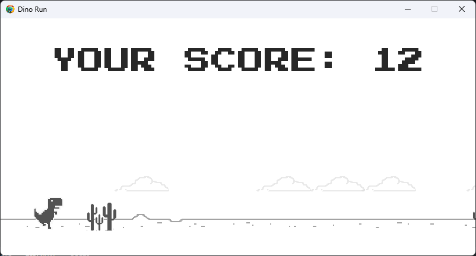

# Dino Run

Dino Run is a simple game built using Python and Pygame library.

## Description

Dino Run is a side-scrolling game where the player controls a dinosaur character, navigating it through various obstacles. The game features dynamically generated obstacles and clouds, with the player aiming to survive for as long as possible while accumulating points.

## Features

- Simple and intuitive controls.
- Dynamic obstacle generation for endless gameplay.
- Score tracking to keep track of the player's performance.
- Sound effects for an immersive experience.

## Installation

1. Clone the repository to your local machine:

git clone

2. Navigate to the project directory:

cd dino-run

3. Install the required dependencies:

pip install pygame

4. Run the game:

python main.py

## Controls

- **Spacebar:** Jump
- **S:** Duck

## How to Play

- Press the **Enter** key to start the game.
- Use the controls to navigate the dinosaur character:
- Press **Spacebar** to jump over obstacles.
- Press **S** to duck under obstacles.
- Avoid colliding with obstacles to stay alive and earn points.

## Acknowledgements

- This game was created using the [Pygame](https://www.pygame.org/) library.
- Sound effects obtained from [Uppbeat](https://uppbeat.io/sfx).
- Fonts used:
- Press Start 2P Regular: [Google Fonts](https://fonts.google.com/specimen/Press+Start+2P)

## Contributing

Contributions are welcome! If you'd like to contribute to this project, please fork the repository and create a pull request.

## License

This project is licensed under the [MIT License](LICENSE).

---

